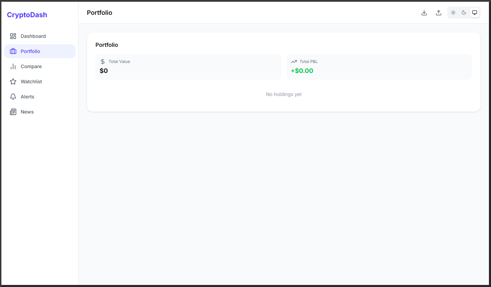

# Crypto Dashboard




> ⚠️ Replace the image above with a real project screenshot.
> You can upload a screenshot named `preview.png` inside the `/public` folder,
> or change the image path to any hosted image URL.

---

## Live Demo

🔗 https://crypto-dashboard-ten-chi.vercel.app/

---

## Overview

Crypto Dashboard is a modern, responsive web application built with **Next.js** and **TypeScript** for visualizing and interacting with cryptocurrency market data.

The project focuses on clean UI, performance, and scalable architecture — making it suitable as a production-ready front-end application.

---

## Key Features

- 📊 Real-time cryptocurrency market data display
- ⚡ Fast and optimized performance with Next.js
- 🎯 Clean, modern, and responsive UI
- 🧩 Component-based architecture
- 🛠 Type-safe development using TypeScript
- 🎨 Styled with Tailwind CSS

---

## Tech Stack

- **Next.js**
- **React**
- **TypeScript**
- **Tailwind CSS**
- **ESLint**
- **Vercel** (Deployment)

---

## Getting Started

### 1. Clone the repository

```bash
git clone https://github.com/fmadihi/crypto-dashboard.git
cd crypto-dashboard
```

### 2. Install dependencies

```bash
npm install
```

### 3. Run the development server

```bash
npm run dev
```

Open:

```bash
http://localhost:3000
```

---

## Production Build

```bash
npm run build
npm start
```

---

## Project Structure

```bash
app/        # Application routes and pages
public/     # Static assets
```

---

## Deployment

This project is deployed on Vercel:

https://crypto-dashboard-ten-chi.vercel.app/

---

## About This Project

This project was developed as part of my front-end portfolio, demonstrating:

- Strong understanding of modern React patterns
- Clean component architecture
- Performance-oriented development
- Production-ready deployment workflow

---

## License

This project is open for review and portfolio purposes.
